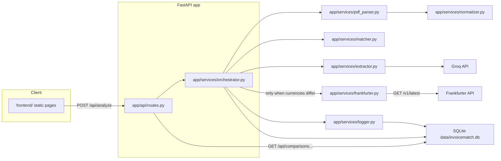
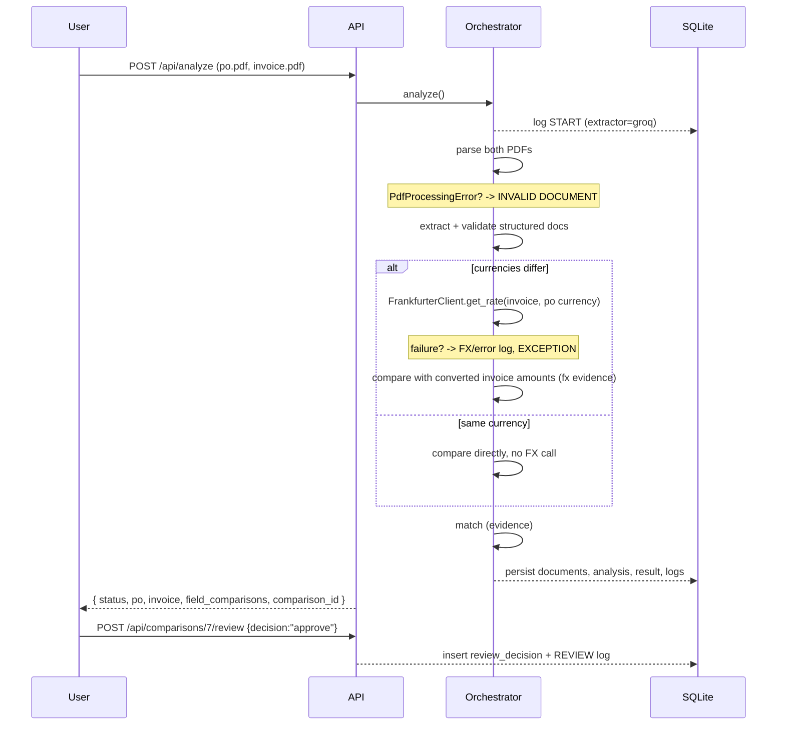

# Architecture

## Overview

InvoiceMatch AI OS is a small, stateless-by-design FastAPI application that
turns two PDF uploads into one classified comparison with review evidence.
Cross-currency documents are converted through the public Frankfurter
exchange-rate API (the second external integration, alongside Groq).
Persistence is a single SQLite file with five tables. The frontend is plain
HTML/CSS/JS served statically by the same server.

## Components

### config (`app/config.py`)

A frozen `Settings` dataclass built from environment variables (optionally
loaded from `.env`). Cached with `lru_cache`; `reload_settings()` clears the
cache for tests. Every module reads configuration only through `get_settings()`
so tolerances and models are never duplicated.

### PDF parser (`app/services/pdf_parser.py`)

Validates magic bytes + extension, enforces a size limit, then opens the PDF
with `pypdf`. Failure modes map to stable codes:

| Code | Meaning |
|---|---|
| `invalid_type` | Not a PDF |
| `too_large` | Over `PDF_MAX_SIZE_MB` |
| `corrupt` | `pypdf` cannot parse it (incl. encrypted) |
| `empty` | Zero pages |
| `no_text` | Page(s) exist but no text layer → scanned/image-only |

Scanned/invoice PDFs must never silently proceed, so `no_text` is a hard stop.

### Extractors (`app/services/extractor.py`)

Two families, both returning the same JSON shape:

- **Groq**: prompt-based LLM extraction with bounded retries. Never logs the
  API key, and a malformed/object-only response is rejected by schema
  validation.
- **Deterministic**: regex/fixed-layout extraction used **only** for tests and
  evaluation. It is never a silent production fallback; `EXTRACTOR_MODE`
  explicitly selects which one runs.

Outputs pass `app/models/documents.py` Pydantic validation, then get
normalized to a JSON-safe form (`walk_json`), since money is stored as
`Decimal`/strings — never floats.

### Normalizer (`app/services/normalizer.py`)

- `normalize_text`: lowercase, collapse whitespace, strip punctuation,
  full-width→ASCII.
- `parse_number`: handles `2,000.00`, `2000,00`, `$150.00`, `(10.50)`, signs.

Single-line-item PDFs that vary only in spacing/case/punctuation still match
(covered by evaluation case 9).

### Matcher (`app/services/matcher.py`)

Deterministic, evidence-producing comparison:

- header strings: `vendor`, `po_number`, `currency`
- totals: `subtotal`, `tax`, `total` within `AMOUNT_TOLERANCE`
- line items paired by normalized description, each comparing `quantity`
  (`QUANTITY_TOLERANCE`), `unit_price`, `total_price`
- a field missing on both sides counts as **consistent**, not an exception

Every check emits a `FieldComparison` (values, difference, status, reason).
Overall: zero unsatisfied checks → `MATCH`/HIGH; otherwise `EXCEPTION` with a
confidence (`LOW` if >2 exceptions, else `MEDIUM`). `INVALID DOCUMENT` is
determined upstream in the orchestrator.

**Cross-currency documents.** When PO and invoice differ in currency, the
matcher converts the *invoice* amounts to the PO currency using the rate
supplied by the orchestrator (`1 invoice_currency = rate po_currency`, all
Decimal arithmetic). `converted` is a per-field evidence status — the business
outcome is still `MATCH` or `EXCEPTION`. Converted fields carry an `fx` block
(rate, date, source) so the conversion is auditable. Quantities are never
converted. If the currencies differ but no rate is available, the currency
field is a mismatch ("exchange rate unavailable") and amount fields are skipped
— the result is `EXCEPTION`, never a silent approval. Same-currency documents
ignore the rate entirely and behave exactly like the pure comparison.

### Orchestrator (`app/services/orchestrator.py`)

`analyze()` is the single entry point that:

1. logs stage `START` with the active `extractor=...`
2. parses both PDFs (any `PdfProcessingError` → `INVALID DOCUMENT`)
3. extracts + validates both docs
4. if a document is unreadable, **bails early** — the healthy PDF is not
   extracted (matches evaluation case 10 expectations)
5. fetches a Frankfurter rate (stage `FX`) **only** when the currencies
   differ; a failed fetch is logged (stage `FX`/error) and handled as a
   reviewable `EXCEPTION`, not a crash
6. runs the matcher, persists document/analysis/comparison/log rows, and
   returns the API payload

### Currency conversion (`app/services/frankfurter.py`)

Thin client over the public Frankfurter API (`GET {base}/latest?from=X&to=Y`),
which serves ECB reference rates and needs no API key. The orchestrator calls
it only for cross-currency documents. Failures (invalid code, HTTP error, no
rate, network/timeout) raise `RateFetchError`, which the orchestrator catches
and turns into a logged, reviewable `EXCEPTION`. This is the second external
integration required by the quest; Groq remains the AI extraction integration.

### Persistence (`app/db/database.py`)

Five tables — `documents`, `analyses`, `comparison_results`,
`review_decisions`, `processing_logs` — with a connection per operation (safe
in FastAPI's thread pool), WAL mode, and `use_database()` for test/eval
isolation. No ORM.

## Data flow

## Evaluation wiring

`evaluation/run_evaluation.py` runs the real pipeline against the 10 fixture
pairs in a throwaway SQLite DB, `commit=False`. It records the extractor label
per run, computes extraction accuracy field-by-field, and saves tagged JSON
results to `evaluation/results/`. The synthetic baseline
(`evaluation/baseline.py`) is explicitly labeled as an estimate for time/ROI
illustration, never a measured headcount claim. The pytest module
`tests/test_evaluation.py` reuses the same runner once per session to assert
reproducibility.

## Security notes

- Secrets only via `.env`; nothing hardcoded; keys never logged.
- No raw tracebacks ever reach clients (`/api/analyze` wraps exceptions).
- `DOCROOT`/static mounting happens **after** API routes so `/api/*` cannot be
  shadowed.
- SQL is parameterized throughout; input sizes are bounded.